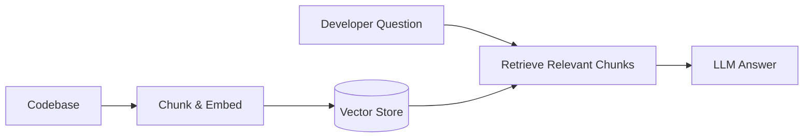
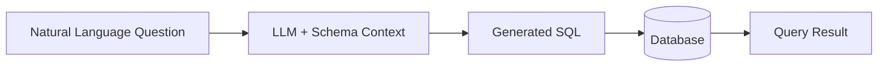
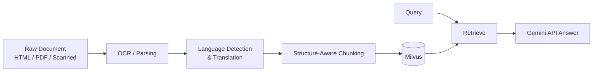
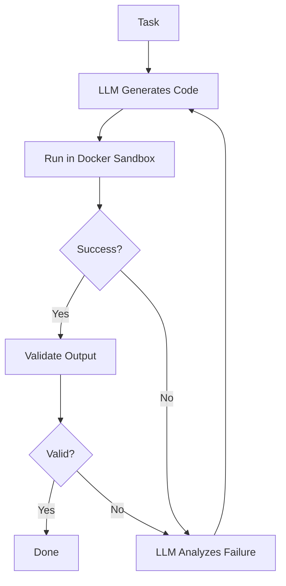

<p align="center">
  
</p>

<h3 align="center">AI/ML engineer. I build the parts most people skip — retries, validation, sandboxing.</h3>

---

### About

I'm a Computer Science undergrad specializing in AI/ML at VIT-AP University. I previously interned at Quiddity in Hyderabad, where I built a multilingual RAG agent from the ground up — parsing, translation, and retrieval.

What I care about most in a system is what happens when things go wrong: does it fail silently, or does it tell you why and try to recover. That's the question behind most of what I build.

Right now I'm working on an autonomous coding agent — an LLM that writes code, runs it in a sandbox, reads its own failures, and retries with a fix.

---

### Stack

Python, FastAPI, Docker, Milvus, Gemini API, SQL, Java, pandas, pytest

---

### Projects

**Developer Knowledge Assistant**
RAG-powered assistant for codebases. Embeddings, vector search, FastAPI backend.



[repo →](#)

**Text-to-SQL Interface**
Translates natural language questions into SQL queries against a real database schema.



[repo →](#)

**Multilingual RAG Agent**
Hybrid retrieval over multilingual, OCR'd documents. Structure-aware chunking, Milvus, Gemini API.



[repo →](#)

**Autonomous Coding Agent** — in progress
Self-correcting code execution: generate, sandbox, observe, fix, retry. Design is done, build is underway.



[repo →](#)

---

### Contact

LinkedIn: [add your link]
Email: [add your email]

<!--
SETUP NOTES FOR RUTH (delete before publishing):
1. Save as README.md in a repo named exactly your GitHub username — GitHub renders it
   as your profile page automatically.
2. Replace every "#" with your real repo URLs, and the LinkedIn/email placeholders.
3. The banner at the top is the only image/widget left in — it's from capsule-render,
   free, no signup. Change "Ruth" in the URL text= param if you ever want different
   banner text, or drop the whole <p> block if you'd rather have zero images at all.
4. No badges, no stats widgets, no emojis — kept it to your actual words.
5. The flowcharts under each project use Mermaid syntax — GitHub renders these natively
   in markdown, no image hosting or external service needed. Edit the boxes/arrows
   directly in the ```mermaid code blocks if your actual pipeline differs.
-->
