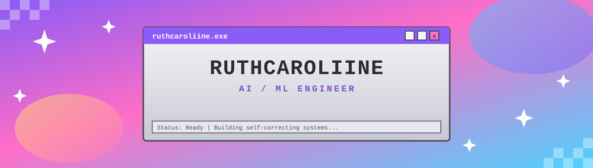
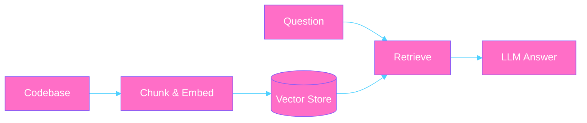
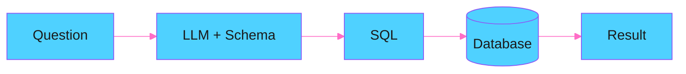
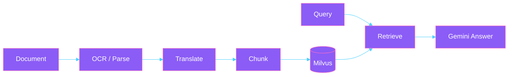
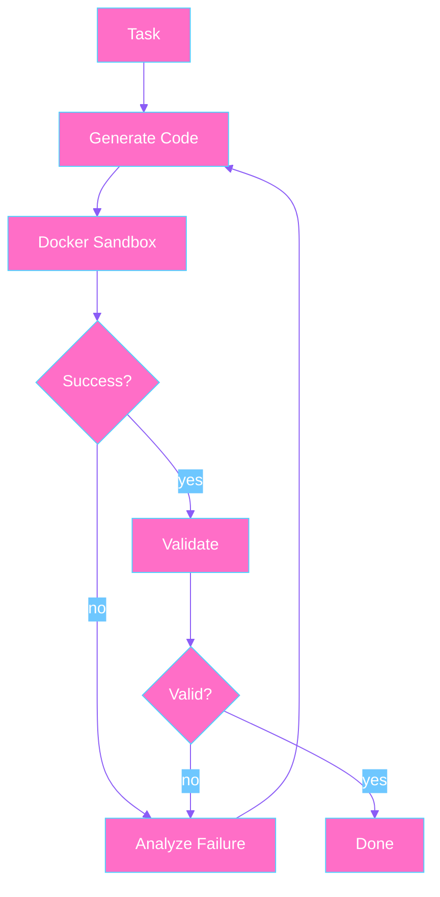
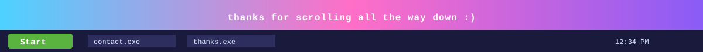

<p align="center">
  
</p>

<p align="center">
  <sub>💾 My Computer&nbsp;&nbsp;&nbsp;📁 My Documents&nbsp;&nbsp;&nbsp;🗑️ Recycle Bin&nbsp;&nbsp;&nbsp;💿 Portfolio.exe</sub>
</p>

<p align="center">
  
</p>

<p align="center">
  
</p>

<br>

```
╔══════════════════════════════════════╗
║  ABOUT.EXE                         ║
╚══════════════════════════════════════╝
```

<p align="center">
  
</p>

<br>

<p align="center">
  
  
  
</p>

```
╔══════════════════════════════════════╗
║  STACK.EXE                         ║
╚══════════════════════════════════════╝
```

<p align="left">
  
  
  
  
  
  
  
  
  
</p>

<p align="center">
  
  
  
</p>

```
╔══════════════════════════════════════╗
║  PROJECTS.EXE                      ║
╚══════════════════════════════════════╝
```

### 💿 developer-knowledge-assistant.exe
RAG-powered assistant for codebases — embeddings, vector search, FastAPI backend.


[→ repo](#)

### 💿 text-to-sql-interface.exe
Translates natural language questions into SQL queries against a real database schema.


[→ repo](#)

### 💿 multilingual-rag-agent.exe
Hybrid retrieval over multilingual, OCR'd documents — structure-aware chunking, Milvus, Gemini API.


[→ repo](#)

### 💿 autonomous-coding-agent.exe `[IN PROGRESS]`
Self-correcting code execution: generate, sandbox, observe, fix, retry. Design complete, build underway.


[→ repo](#)

<p align="center">
  
  
  
</p>

```
╔══════════════════════════════════════╗
║   CONTACT.EXE                      ║
╚══════════════════════════════════════╝
```

<p align="center">
  <a href="#"></a>
  <a href="mailto:you@example.com"></a>
</p>

<p align="center">
  <sub>◄ prev&nbsp;&nbsp;&nbsp;·&nbsp;&nbsp;&nbsp;member of the ai/ml webring&nbsp;&nbsp;&nbsp;·&nbsp;&nbsp;&nbsp;next ►</sub>
</p>

<p align="center">
  
</p>
