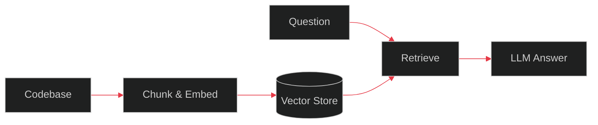
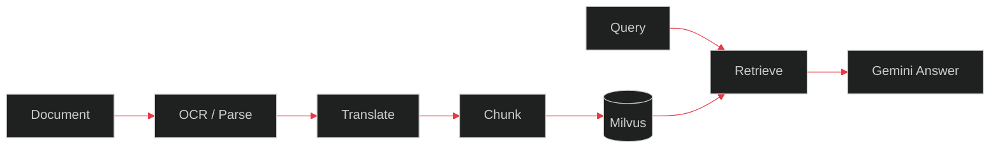
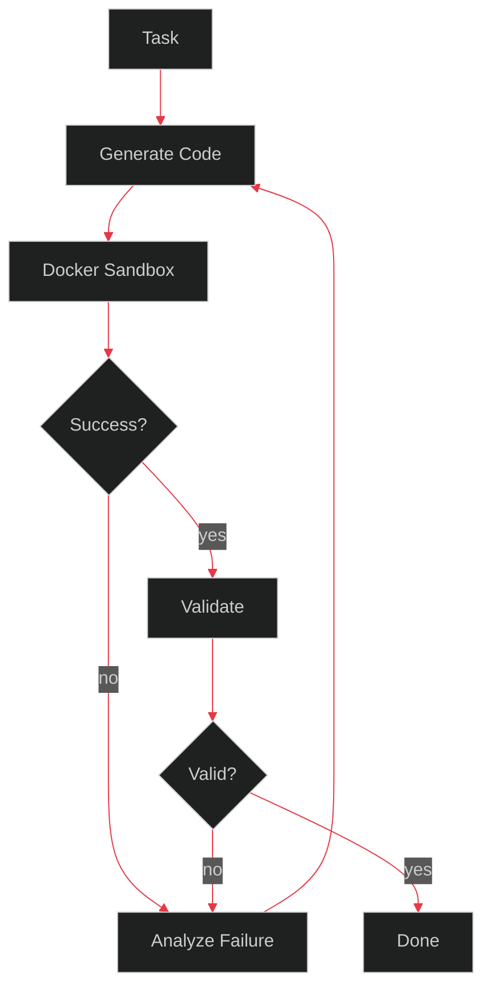

<p align="center">
  
</p>

<p align="center">
  
</p>

<p align="center"></p>

```
┌──(ruth@github)-[~]
└─$ cat about.md
```

Computer Science undergrad specializing in AI/ML at VIT-AP University. Previously interned at Quiddity in Hyderabad, building a multilingual RAG agent from parsing to retrieval.

I care about what a system does when it fails — silent failure vs. self-diagnosis and recovery. That's the thread running through everything below.

```
┌──(ruth@github)-[~]
└─$ ls stack/
```

<p align="left">
  
  
  
  
  
  
  
  
  
</p>

<p align="center"></p>

```
┌──(ruth@github)-[~]
└─$ ls projects/
```

### `01_developer-knowledge-assistant`
RAG-powered assistant for codebases — embeddings, vector search, FastAPI backend.


[→ repo](#)

### `02_text-to-sql-interface`
Translates natural language questions into SQL queries against a real database schema.


[→ repo](#)

### `03_multilingual-rag-agent`
Hybrid retrieval over multilingual, OCR'd documents — structure-aware chunking, Milvus, Gemini API.


[→ repo](#)

### `04_autonomous-coding-agent` `IN_PROGRESS`
Self-correcting code execution: generate, sandbox, observe, fix, retry. Design complete, build underway.


[→ repo](#)

<p align="center"></p>

```
┌──(ruth@github)-[~]
└─$ cat contact.txt
```

LinkedIn: [add your link]
Email: [add your email]

<p align="center">
  
</p>

<!--
SETUP NOTES FOR RUTH (delete before publishing):
1. Save as README.md in a repo named exactly your GitHub username — GitHub renders it
   as your profile page automatically.
2. Replace every "#" with real repo URLs, and the LinkedIn/email placeholders.
3. Terminal prompt blocks (the ┌──(ruth@github)... lines) are plain text in code fences —
   edit "ruth" to your actual username if you want it to match exactly.
4. Mermaid diagrams have a dark theme init line at the top of each block so they render
   black/red instead of GitHub's default light theme — edit the boxes/arrows if your
   actual pipeline differs.
5. Banner top/bottom and typing animation are free third-party services (capsule-render,
   readme-typing-svg) — no signup needed.
-->
